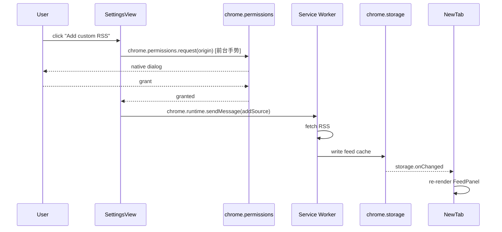

# 实施 Plan：Chrome 新标签页 Dashboard（TickTick + 信息流）

> 上游 Spec：`.omc/specs/deep-interview-chrome-newtab-ticktick.md`
> Ambiguity 12.2%，PASSED。本 plan 为 Ralplan 共识循环 R2 修订版（已合并 Architect R1 + Critic R1 反馈）。
> 模式：**SHORT**（自用 + 开源自部署，非 deliberate）
> R2 修订记录：见文末 §10。

---

## 1. RALPLAN-DR 短模式摘要

### 1.1 Principles（架构原则）

1. **Local-first，零后端**：所有 token / 缓存 / 已读状态都在 `chrome.storage.local` 或 IndexedDB；不引入任何中央代理或云服务。
2. **Stale-while-revalidate**：暖启动（已有缓存）首屏永远先吐缓存（保 ≤500ms 任务、≤1s 信息流）；冷启动（首次安装）显式走 skeleton + 首次同步路径，5s 超时给重试入口。
3. **Adapter 模式隔离平台差异**：`RSSAdapter` / `JuejinAdapter` / `TickTickConnector` 都实现统一接口（`fetch() → NormalizedItem[]`），新增源（v2 Notion / Calendar）只需新增 adapter，UI 与聚合层不变。
4. **MV3 service worker 作单一刷新中枢**：`chrome.alarms` 2h 触发 → service worker 拉所有源 → 写存储 → 通过 `chrome.storage.onChanged` 通知 newtab 页。避免 newtab 自己开计时器导致多 tab 重复请求。`chrome.permissions.request` 例外——必须 newtab 前台手势触发，SW 永不调用。
5. **失败可见但不阻断 = 单源失败行内提示 + 离线时 disable 写操作**：每个 widget 独立失败边界，单源错误降级到行内提示 + 上一份缓存；离线时 TaskItem checkbox 直接 disable + tooltip "网络断开，恢复后再勾选"，不引入 outbox 队列（v1.1 候选，见 §6 R10）。

### 1.2 Decision Drivers（按重要性）

1. **首屏性能硬指标**（暖启动 AC-T1-warm ≤500ms / AC-F3-warm ≤1s；冷启动 AC-T1-cold skeleton ≤200ms + 首次同步 ≤5s）—— 决定缓存策略、构建产物大小。
2. **MV3 service worker 限制**—— 决定 OAuth、定时任务、跨域 fetch、permissions 请求的实现路径。
3. **开源自部署友好度**—— 决定 client_secret 处理方式、host_permissions 颗粒度、文档完整度、extension-id 一致性。

### 1.3 Viable Options

#### Option A：Vue 3 + Vite + Pinia + uPlot（**推荐**）

- **Pros**:
  - Vue 3 SFC + `<script setup>` 单文件极简，模板对卡片流友好；
  - Vite + `@crxjs/vite-plugin` 对 MV3 一体化；
  - Pinia 体积小（~2KB），与 chrome.storage 双向同步成本低；
  - uPlot 单文件 ~40KB（备选 Chart.js bar-only 或手写 SVG）；
  - 用户偏好 Vue（spec round 11 默认倾向）。
- **Cons**:
  - Vue 在 Chrome 扩展里资料略少于 React；
  - 对 React 熟练贡献者有学习成本（自用项目影响小）。

#### Option B：React 18 + Vite + Zustand + uPlot

- **Pros**:
  - 社区资料最多，MV3 + React 坑多有现成解；
  - `zustand/middleware/persist` 有现成 chrome.storage adapter；
  - JSX 在条件渲染 / 列表 key 上更紧凑。
- **Cons**:
  - React + ReactDOM 基线 ~44KB（gzip），相对 Vue 3 (~34KB) 多 10KB——在 200KB 总预算下非硬约束；
  - 用户偏好倾向 Vue（这是真正的决策依据）。

#### Option C：纯 Vanilla TS + lit-html + uPlot

- **Pros**: 体积最小（< 30KB total）。
- **Cons**: settings 表单 / 异步加载态全要手写。**淘汰**：开发效率与首屏预算之间，A 已能同时满足。

**结论**：选 **Option A**（用户偏好 + Vue 模板对静态卡片流紧凑）。Option B 是合格备选；Option C 仅在未来若首屏严重超预算时回退。

---

## 2. 五大开放点决策

### OP-1 掘金登录态

- **决策**：**v1 默认走公开推荐流端点（无需登录、无需签名头）；cookie 仅作个性化升级的可选项**。
- **背景（M0 实测，证据见 `.omc/research/juejin-cookie-schema.md`）**：`POST https://api.juejin.cn/recommend_api/v1/article/recommend_all_feed` 等公开端点 curl 直接 HTTP 200，返回完整 JSON（标题/作者/封面/brief_content/tag），不需要 cookie 也不需要 X-Bogus 等签名头。原"必须 cookie"的悲观假设被推翻。
- **v1 实施路径**：
  - 默认：adapter 直接调公开推荐流，首次安装即可看到内容，无授权阻塞。
  - 可选升级：settings 页提供 **"Connect Juejin (optional)"** 入口，使用 `chrome.cookies` 读取 `sessionid` 等，附带到请求头以**可能**返回更个性化结果；未连接时退化到公开推荐流（同一端点）。
- **不在 v1 范围**：关注流（follow feed）需登录态 + 可能触发签名校验，列入 v1.1 backlog（见 §6 R10）。
- **依赖**：无（M0 已落地结论）。

### OP-2 RSS 跨域 host_permissions

- **决策**：**(c) optional_host_permissions + 启动时 declarative + 添加订阅时按需 grant**。
- **关键约束**：`chrome.permissions.request` 必须由 newtab 前台用户手势触发（M4 显式 AC，详见 §M4 时序图）。
- **理由**：
  - (a) `<all_urls>` 透明度差；(b) 每加新源重打包违背 AC-F1；(c) 内置三个固定域 + 用户自定义按需 grant 最平衡。
  - 降级：README 提供 escape hatch — 高级用户可手动改 manifest 加 `<all_urls>` 重打包。

### OP-3 离线 / token 过期 / RSS 失败降级 UI

| 故障类型 | TaskPanel 表现 | FeedPanel 表现 |
|---|---|---|
| **离线（navigator.onLine=false）** | 顶部细条黄色提示"离线，显示上次缓存（X 分钟前）"；任务列表保持上次缓存可视；**checkbox disabled + tooltip："网络断开，恢复后再勾选"**（不入 outbox） | 同顶部提示；卡片照常展示缓存；"刷新"按钮 disabled 并 tooltip "网络断开" |
| **TickTick token 过期** | 任务区域显示空态卡片"TickTick 授权已过期"+ 主按钮"重新连接"；完成比和趋势图仍显示上次缓存（灰阶） | 不受影响 |
| **某个 RSS 源 fetch 失败** | 不受影响 | 该源在聚合流中暂不出新内容；settings 页订阅源行变红色感叹号 + 上次成功时间；FeedPanel 顶部出现可折叠 "1 个源拉取失败 ▼" 提示，展开看详情 |
| **全部 RSS 源失败** | 不受影响 | FeedPanel 显示空态"暂无可用内容"+ 一键重试 |

- **理由**：所有故障保留"展示上次缓存 + 行内提示"原则，绝不全屏 error。**v1 不引入 outbox**——离线勾选场景占比 < 1%，复杂度不划算（v1.1 backlog 见 §6 R10）。

### OP-4 TickTick 7/30 天趋势数据源（**单路径**）

- **决策**：**v1 本地 ledger 单路径**。
- **执行**：
  1. M0 spike 必须先在 `.omc/research/ticktick-api-probe.md` 输出实测结果：OAuth 端点 / scope / PKCE 支持 / 已完成任务时间范围 API 是否存在（yes/no 明确结论）。
  2. v1 实施：每天 service worker alarm 首次触发时把当日 `today.completed.length` 写入 `chrome.storage.local` 的 `dailyCompletionLedger`（key=YYYY-MM-DD）。前 7/30 天累积起来即趋势。
  3. 数据点 < 7 时 UI 显示 onboarding 提示"首日提示"卡片 + 渐变填充 + 文案"积累中（n/30 天），明天起将展示完整趋势"。
  4. 若 M0 spike 意外发现 TickTick 暴露时间范围 API → 列入 **v1.1 增强项**（不并入 v1，避免分支判断），新建 issue 跟踪。
- **理由**：消除 hybrid 双路径的实施期不确定性；ledger 路径代码量小、可测、可解释；冷启动 30 天空窗用 onboarding 管理预期。
- **风险登记联动**：R1 改写为"TickTick API 长期不可用 → ledger 兜底，无功能丧失"。

### OP-5 任务列表来源边界

- **决策**：**v1 = 客户端过滤 `dueDate <= today AND status != completed`，无 settings 配置项**。
- **重要语义说明**：v1 的"今日"**不假装等于** TickTick 服务端 smart list；TaskPanel 顶部小字显式标注"今日 = 截至当天到期且未完成"以管理用户预期。README 自部署文档同步说明此差异。
- **理由**：服务端 smart list 语义模糊（是否含 null due 拖入任务、共享任务等）；客户端过滤可解释、可测。
- **v2 候选**：增加"项目子集"配置进 settings（已记入 risk register）。

---

## 3. 技术栈最终选择

| 维度 | 选择 | 理由 |
|---|---|---|
| 前端框架 | **Vue 3.4** + `<script setup>` + TS | 用户在 Vue/React 之间二次独立 deliberation 后选定（2026-05-07）：bundle 比 React 小 12-22KB（冷启动收益）、computed 派生比 useMemo 手动依赖更省事、SFC 适合多小 widget。**已锁定，不要再改框架。** |
| 构建工具 | **Vite 5** + **`@crxjs/vite-plugin`** | MV3 一体化；M1 备选 `vite-plugin-web-extension`（aklinker1）若 CRXJS 出问题 |
| 状态管理 | **Pinia** + 自写 `chromeStoragePlugin` | 双向绑定 `chrome.storage.local`，跨 tab 同步用 `storage.onChanged` |
| 路由 | newtab 单页内条件渲染（dashboard/settings 两 view） | 减少体积 |
| 图表 | **uPlot** | 40KB；备选 Chart.js bar-only 或手写 SVG（30 数据点足以） |
| RSS 解析 | 原生 **`DOMParser`** + 自写 normalizer（RSS 2.0 + Atom 1.0） | 不引 `rss-parser` |
| 缩略图 | RSS `media:thumbnail` → `enclosure[type^=image]` → `<description>` 首图正则 → `og:image`（仅 SW 后台拉，首屏不阻塞） | 首屏不阻塞 |
| HTTP | 原生 `fetch` + 自写 retry/timeout wrapper（`AbortController` + 8s timeout per fetch） | 不引 axios |
| Icon | **Lucide-vue-next** 按需 tree-shake | |
| 样式 | **Tailwind CSS 3.4** (JIT) + `tailwindcss/postcss` | 用户选定（2026-05-07）：成熟生态、文档完备、Vite 集成 `@tailwindcss/vite` 一键、JIT 产物已经足够小（5-8KB）。**已锁定，不要再改样式方案。** |
| 单元测试 | **Vitest** + `@vue/test-utils` + **`jest-webextension-mock`**（chrome API mock 起点，活跃维护、面向 MV3）+ 自写 `tests/helpers/chromeMock.ts` 覆盖 5 个核心 API（`chrome.alarms` / `chrome.storage.onChanged` / `chrome.identity.launchWebAuthFlow` / `chrome.cookies.get` / `chrome.permissions.request`）；环境用 happy-dom。<br/>注：`sinon-chrome` 最新版 3.0.1 发布于 2019、面向 MV2，**不再推荐作为单一选择**，仅在团队偏好时作为可选回退 | SW 模块拆纯函数（Vitest happy-dom）+ 适配层（Playwright e2e） |
| E2E | **Playwright** + `chromium.launchPersistentContext` 加载 unpacked 扩展 | MV3 扩展 e2e 行业标准 |
| Lint / Format | ESLint + Prettier + `@typescript-eslint` + `oxlint`（CI 预检） | |
| 包管理 | **pnpm** | |

---

## 4. 文件结构

```
AIRSS/
├── manifest.config.ts                # @crxjs TS 描述 manifest，含固定 key（pubkey base64）
├── keys/
│   └── extension-pub.pem             # 固定公钥，git 跟踪；保证多机 extension-id 一致
├── vite.config.ts
├── package.json
├── tsconfig.json
├── tailwind.config.ts
├── postcss.config.cjs
├── playwright.config.ts
├── vitest.config.ts
├── README.md                         # 自部署指南（M10 显式 10 步）
├── LICENSE                           # MIT，M1 落地
├── NOTICE.md                         # 第三方依赖 license 列表，M1 落地
├── .env.example                      # TICKTICK_CLIENT_ID= / TICKTICK_CLIENT_SECRET=（视 M0 spike 决定是否需要）
├── .github/
│   ├── workflows/
│   │   ├── ci.yml                    # PR 触发 typecheck + lint + vitest + playwright headless
│   │   └── release.yml               # tag 触发，产出不含 .env 的 .zip（actions/upload-artifact 显式排除 .env*）
│   ├── dependabot.yml
│   └── PULL_REQUEST_TEMPLATE.md
├── docs/
│   ├── self-host.md                  # client_id/secret 申请 + extension-id 一致性章节 + 加载教程
│   ├── ticktick-oauth.md             # M0 spike 落地的 OAuth 模式说明
│   └── juejin-cookie.md
├── public/
│   └── icons/                        # 16/32/48/128 PNG
├── src/
│   ├── newtab/                       # newtab override 入口
│   │   ├── index.html
│   │   ├── main.ts
│   │   ├── App.vue
│   │   ├── views/
│   │   │   ├── DashboardView.vue
│   │   │   └── SettingsView.vue
│   │   ├── components/
│   │   │   ├── task/
│   │   │   │   ├── TaskPanel.vue
│   │   │   │   ├── TaskItem.vue
│   │   │   │   ├── CompletionRatio.vue
│   │   │   │   └── TrendChart.vue
│   │   │   ├── feed/
│   │   │   │   ├── FeedPanel.vue
│   │   │   │   ├── FeedCard.vue
│   │   │   │   └── FeedSourceErrorBanner.vue
│   │   │   ├── settings/
│   │   │   │   ├── SubscriptionList.vue
│   │   │   │   ├── AddSubscriptionDialog.vue
│   │   │   │   ├── TickTickConnectSection.vue
│   │   │   │   └── JuejinAuthSection.vue
│   │   │   └── shared/
│   │   │       ├── EmptyState.vue
│   │   │       ├── OfflineBanner.vue
│   │   │       ├── LoadingSkeleton.vue
│   │   │       └── ColdStartOnboarding.vue   # 数据点 < 7 时显示
│   │   └── stores/
│   │       ├── tasks.ts
│   │       ├── trend.ts
│   │       ├── feed.ts
│   │       ├── subscriptions.ts
│   │       ├── readState.ts
│   │       └── settings.ts
│   ├── background/                   # service worker
│   │   ├── index.ts
│   │   ├── refreshScheduler.ts
│   │   ├── feedRefreshJob.ts
│   │   └── tickTickRefreshJob.ts     # 含 dailyCompletionLedger 写入
│   ├── adapters/
│   │   ├── types.ts
│   │   ├── rss/
│   │   │   ├── RSSAdapter.ts
│   │   │   ├── parser.ts
│   │   │   └── thumbnail.ts
│   │   ├── substack/SubstackAdapter.ts
│   │   ├── medium/MediumAdapter.ts
│   │   ├── juejin/
│   │   │   ├── JuejinAdapter.ts
│   │   │   ├── recommendEndpoint.ts  # M0 已确认 path: /recommend_api/v1/article/recommend_all_feed（公开端点）
│   │   │   └── cookieReader.ts
│   │   └── ticktick/
│   │       ├── TickTickConnector.ts
│   │       ├── oauth.ts              # client_secret post 模式（M0 已锁定）
│   │       ├── tokenStore.ts
│   │       └── completionLedger.ts   # 单路径 ledger
│   ├── core/
│   │   ├── storage.ts
│   │   ├── permissions.ts
│   │   ├── http.ts                   # AbortController + 8s timeout
│   │   ├── dedup.ts
│   │   ├── aggregator.ts
│   │   ├── logger.ts
│   │   └── time.ts
│   └── shared/
│       ├── constants.ts
│       └── env.ts
└── tests/
    ├── unit/
    │   ├── rss-parser.spec.ts
    │   ├── dedup.spec.ts
    │   ├── aggregator.spec.ts
    │   ├── completionRatio.spec.ts
    │   ├── completionLedger.spec.ts
    │   ├── tokenStore.spec.ts
    │   └── thumbnail.spec.ts
    ├── fixtures/
    │   ├── substack-feed.xml
    │   ├── medium-atom.xml
    │   └── juejin-recommend.json
    └── e2e/
        ├── cold-start.spec.ts        # 冷启动 skeleton + 首次同步
        ├── warm-start.spec.ts        # 暖启动 ≤500ms / ≤1s
        ├── fresh-install.spec.ts     # 完整 install + OAuth 流程
        └── helpers/loadExtension.ts
```

---

## 5. 实施步骤（里程碑）

> 每步含：交付物 / 依赖 / 验收标准（关联 spec AC 编号）

### M0 — 前置 spike（必须先于 M1 编码）

- **交付物**：
  - `.omc/research/ticktick-api-probe.md`：OAuth 端点 / scope / PKCE 支持判定 / 已完成任务时间范围 API 实测结果（每项含 yes/no 明确结论）；**关键产出 = OAuth 模式判定**（PKCE-only / 需 client_secret），决定 M2 实施分支。
  - `.omc/research/juejin-cookie-schema.md`：juejin.cn 当前 cookie 字段（sessionid 等）、HttpOnly/SameSite 状态、`api.juejin.cn/recommend_v2`（或现行端点）的请求 schema 与是否需要 X-Bogus 等签名头。
- **依赖**：无。
- **验收**：
  - 两份研究文档在 git 中 commit；
  - 两份关键判定项各有明确 yes/no 结论；
  - TickTick OAuth 模式（PKCE / secret）确定，文档化在 `docs/ticktick-oauth.md`；
  - **spike 必须显式产出 "Failure-Mode Fallback" 降级决定**（写入两份 `.omc/research/*.md` 的同名章节）：
    - 若 TickTick OAuth 端点返回 401/403 或 PKCE 不被支持 → **降级路径 X**：v1 不接 TickTick API，TaskPanel 改为本地 todo（`chrome.storage.local` 简单清单 + 手动勾选），趋势图仅基于本地 ledger，settings 显式提示"TickTick 集成不可用，已降级为本地任务"，正式接入推迟到 v1.1；
    - 若 juejin `api.juejin.cn/recommend_v2` 需 X-Bogus 等签名头无法绕过 → **降级路径 Y**：(Y1) 强制走"手动粘贴 cookie + 仅订阅 follow_feed"等无签名要求的替代端点；(Y2) v1 不接掘金（仅 RSS + Substack + Medium），掘金推迟到 v2 候选。M0 spike 必须在两条 Y 子路径中二选一并写明理由。

### M1 — 扩展骨架 + MV3 manifest + newtab override 加载 + CI/LICENSE

- **交付物**：
  - pnpm + Vite + @crxjs + Tailwind CSS + Vue 3 项目初始化；
  - `manifest.config.ts`：MV3 + `chrome_url_overrides.newtab` + `service_worker` + `permissions: [storage, alarms, identity, cookies]` + 静态 `host_permissions` 白名单 + `optional_host_permissions: ["https://*/*", "http://*/*"]` + **固定 `key` 字段（pubkey base64）**；
  - `keys/extension-pub.pem`（git 跟踪）；
  - 空 `App.vue` 渲染左右分栏占位；
  - service worker 占位；
  - **`LICENSE`（MIT）+ `NOTICE.md`（第三方依赖 license）**；
  - **`.github/workflows/ci.yml`**（PR 触发 typecheck + lint + vitest + playwright headless）；
  - **`.github/workflows/release.yml`**（tag 触发，产出 zip，`actions/upload-artifact` 排除 `.env*`）；
  - **`.github/dependabot.yml` + `.github/PULL_REQUEST_TEMPLATE.md`**；
  - `docs/self-host.md` 加 "extension-id 一致性"章节（解释固定 key 的作用 + 多机 ID 一致保证）。
- **依赖**：M0。
- **验收**：
  - `pnpm build` 产出 `dist/` 可在 chrome://extensions 加载；
  - 打开新标签页可见占位页，无 console error；
  - **多机 fresh install 后 chrome://extensions 显示 ID 一致**（手动 + 第二台机器验证）；
  - **PR 自动跑 CI 通过**（typecheck + lint + vitest 至少 0 用例 OK + playwright 至少占位 case OK）；
  - 不关联 AC（脚手架）。

### M2 — TickTick OAuth + 今日任务读取 + 勾选回写

- **OAuth 实施分支**：**已锁定 = client_secret post 单分支**（M0 已确认 TickTick 不支持 PKCE-only，证据见 `.omc/research/ticktick-api-probe.md` §一 Q1/Q2 + §二 Failure-Mode Fallback）。
  - **实施**：`chrome.identity.launchWebAuthFlow` 拿 authorization code → 后续 token 交换走 client_secret post 模式（`grant_type=authorization_code` + `client_id` + `client_secret` + `code` + `redirect_uri`）。用户在 `.env.local` 填 `TICKTICK_CLIENT_ID` + `TICKTICK_CLIENT_SECRET`（两项必填），README §1 第一步显著说明 secret 由 fork 用户自填，CI/release 显式排除 `.env*`（见 §6 R4 YAML 示例）。
  - **不再保留 PKCE-only 分支**：M0 已证伪此路径，相关代码与文档不实现。
- **交付物**：
  - `adapters/ticktick/oauth.ts`（按 M0 选定分支实现）；
  - `tokenStore.ts`：access/refresh token 持久化 + 过期 refresh + 并发刷新去重；
  - `TickTickConnector.fetchToday()` / `markTaskComplete(taskId)`；
  - `stores/tasks.ts` + `TaskPanel.vue` + `TaskItem.vue`（**离线时 checkbox disabled + tooltip**，无 outbox）；
  - settings 页 `TickTickConnectSection.vue`；
  - TaskPanel 顶部小字 "今日 = 截至当天到期且未完成"。
- **依赖**：M0、M1。
- **验收**：
  - **AC-T1-warm**：暖启动（已有缓存）newtab 首屏 ≤500ms 列出今日任务（DevTools Performance 录制）；
  - **AC-T1-cold**：冷启动（首次安装、无缓存）skeleton ≤200ms 出现 + 首次同步完成 ≤5s + 5s 超时给重试入口；
  - **AC-T2**：勾选任务后 ≤2s 在 TickTick App / 网页可见状态变更（前提：在线）；
  - 离线时勾选 checkbox 是 disabled 的；
  - 无 token 时显示空态 + Connect 按钮。

### M3 — 完成比 + 7/30 天趋势图（本地 ledger 单路径）

- **交付物**：
  - `CompletionRatio.vue`（响应式 derived，依赖 `tasks` store）；
  - `adapters/ticktick/completionLedger.ts`：service worker alarm 触发时把当日 `today.completed.length` 写入 `dailyCompletionLedger`（key=YYYY-MM-DD）；
  - `TrendChart.vue` + uPlot 集成 + 7/30 切换 tab；
  - `ColdStartOnboarding.vue`：数据点 < 7 时显式 onboarding 提示卡片 + 渐变填充 + "积累中（n/30 天）" 文案；
  - `tickTickRefreshJob.ts`：service worker 在 alarm 中拉今日 + 写 ledger。
- **依赖**：M2。
- **验收**：
  - **AC-T3**：勾选后完成比文本 ≤200ms 更新；
  - **AC-T4**：7d/30d 切换正常；数据缺失时显示 onboarding 提示且 UI 不报错。

### M4 — RSS 通用 fetcher + Substack/Medium adapter + 卡片渲染（含权限协作时序）

- **协作时序图**（newtab 前台 ↔ chrome.permissions ↔ service worker ↔ chrome.storage）：



> 通信通道说明：NewTab/Settings → SW 走 `chrome.runtime.sendMessage`（一次性消息）或 `chrome.runtime.connect`（长连接 Port），**不走 `window.postMessage`**；SW → 前台广播变更走 `chrome.storage.local.set` 触发的 `storage.onChanged` 事件。

- **交付物**：
  - `core/http.ts`（`AbortController` + 8s timeout per fetch）；
  - `RSSAdapter` + `parser.ts`（覆盖 RSS 2.0 / Atom 1.0 / `media:thumbnail` / `enclosure`）；
  - `SubstackAdapter` / `MediumAdapter`（薄壳）；
  - `FeedCard.vue` + `FeedPanel.vue`；
  - `core/permissions.ts`：仅在 newtab 前台用户手势触发 `chrome.permissions.request`；
  - settings 页 `AddSubscriptionDialog`。
- **依赖**：M1。
- **验收**：
  - **AC-F1**：能添加/删除任意 RSS URL；
  - **AC-F2**：Substack / Medium 快捷输入；
  - **AC-F5**：卡片含标题 / 源 / 时间 / 摘要 / 缩略图（缺失字段优雅降级）；
  - **AC-F6**：点击卡片新 tab 打开（`<a target="_blank" rel="noopener">`）；
  - **`permissions.request` 仅在 settings 前台手势触发，service worker 永远不调用**（代码搜索 + e2e 验证）；
  - 单元测试：`rss-parser.spec.ts` 覆盖 5 个 fixture（含畸形）。

### M5 — 掘金 adapter

- **交付物**：
  - `JuejinAdapter.fetchRecommendFeed()`：默认调 M0 实测确认的公开端点 `POST https://api.juejin.cn/recommend_api/v1/article/recommend_all_feed`，**无需 cookie、无需签名头**即可返回 JSON；
  - `adapters/juejin/cookieReader.ts`（`chrome.cookies.get` 取 sessionid 等）：**仅在用户在 settings 完成 "Connect Juejin (optional)" 时启用**，附带 cookie 头到同一公开端点尝试拿更个性化结果；未连接时退化为匿名请求；
  - `JuejinAuthSection.vue`：默认状态文案"已启用掘金公开推荐流（未连接账号）"；按钮 **"Connect Juejin (optional) — 用于个性化推荐"**；连接后显示已连接状态 + 断开按钮；
  - JSON → NormalizedItem normalizer。
- **依赖**：M0、M4。
- **验收**：
  - **AC-F2**（掘金部分）：v1 默认无需任何授权即可在 FeedPanel 看到掘金推荐内容；
  - **新增 AC**：未连接掘金 cookie 时，FeedPanel 仍能展示掘金公开推荐流 ≥30 条；
  - **可选路径**：用户点击 "Connect Juejin"，cookie 读取 + 附带请求成功后内容来源标记为"个性化"；
  - 端点返回非 200 或 schema 不匹配时降级到本地缓存 + settings 红字提示（R2 联动）。

### M6 — 多源聚合 / 去重 / 排序 / 已读状态 / 2h 后台刷新

- **交付物**：
  - `core/aggregator.ts`：合并 + 时间倒序 + 去重；
  - `core/dedup.ts` + 单元测试；
  - `stores/readState.ts`：点击卡片写已读，render 时叠加视觉淡化；
  - `background/refreshScheduler.ts` + `feedRefreshJob.ts`：`chrome.alarms.create("feed-refresh", { periodInMinutes: 120 })`；alarm 用 `Promise.allSettled` + 全局 25s 上限；前台监听 `chrome.storage.onChanged` 平滑刷新；
  - 手动刷新按钮 → `chrome.runtime.sendMessage`。
- **依赖**：M4 + M5。
- **验收**：
  - **AC-F3-warm**：暖启动首屏 ≤1s 见 N（默认 30）条卡片；
  - **AC-F3-cold**：冷启动 skeleton ≤200ms + 首次同步 ≤5s + 5s 超时给重试入口；
  - **AC-F4**：多源时间倒序 + 去重正确（单元测试）；
  - **AC-F7**：已读卡片视觉淡化（opacity 0.5 + 灰度）；
  - **AC-F8**：2h 自动刷新 + 手动刷新均工作（e2e 用 `chrome.alarms.onAlarm` 手动触发模拟）；
  - 单源模拟卡死 60s，其他源仍在 25s 内完成。

### M7 — Settings 页（订阅源管理 + TickTick + 主题切换）

- **交付物**：
  - `SettingsView.vue` 完整版：订阅源 CRUD（编辑 / 启用 / 禁用 / 上次成功时间 / 错误状态）；
  - 主题：light/dark/auto（CSS variables + `prefers-color-scheme`）；
  - "最近 N 条卡片"数值可调（default 30，范围 10-100）。
- **依赖**：M2-M6。
- **验收**：所有 settings 项立即生效（Pinia → storage → 重新聚合）。

### M8 — 错误态 / 离线降级 UI（落地 OP-3，**无 outbox**）

- **交付物**：
  - `OfflineBanner.vue`（监听 `online`/`offline` 事件 + `navigator.onLine`）；
  - `EmptyState.vue` 复用；
  - `FeedSourceErrorBanner.vue`；
  - 离线时 TaskItem checkbox disable + tooltip（**不实现 outbox**）；
  - 各 widget 失败边界。
- **依赖**：M2-M7。
- **验收**：
  - OP-3 表 4 类故障人工演练通过（Network throttling Offline、删 token、改 RSS URL 制造 502）；
  - 离线时勾选 disabled，online 恢复后自动 enable；
  - 不关联硬 AC，但属于 v1 必备 UX。

### M9 — UI 高保真化（**6 项可枚举验收 + 时间盒**）

- **交付物**：autopilot 阶段调用 `frontend-design` 技能，输入 `.omc/specs/ui-design-prompt.md`（已存在），对 `TaskPanel` / `FeedCard` / `SettingsView` 三大表面做视觉迭代；Tokens 落到 `tailwind.config.ts theme.extend`；Skeleton 美化；Logo + 16/32/48/128 icon 出图。
- **时间盒**：**autopilot 轮次硬上限 = 2 轮，超出降级到 M10 不阻塞发布**。
- **依赖**：M8。
- **验收（6 项可枚举）**：
  1. TaskPanel 含完成比文本 + 7d 趋势小图；
  2. FeedCard 含 5 字段（标题 / 源 / 时间 / 摘要 / 缩略图）+ skeleton 态；
  3. SettingsView 三 section（订阅源 / TickTick / 主题与杂项）；
  4. 暗色主题 token 全覆盖（无写死 #fff/#000）；
  5. 16/32/48/128 icon 出图，文件齐全；
  6. Lighthouse newtab 模式 LCP < 1s 且 TBT < 100ms。

### M10 — README + 自部署文档（**显式 10 步 + 时间盒 ≤30 分钟**）

- **交付物**：`README.md` + `docs/self-host.md` + `docs/ticktick-oauth.md` + `docs/juejin-cookie.md`；截图 + GIF；自部署 10 步清单：
  1. 注册 TickTick 开发者账号 + 创建应用；
  2. 在 `.env.local` 填入 `TICKTICK_CLIENT_ID` + `TICKTICK_CLIENT_SECRET`（M0 已确认必填，TickTick Open API 不支持 PKCE-only）；
  3. 复制 `.env.example` → `.env.local`，确认两项 secret 已填；
  4. `pnpm install && pnpm build`；
  5. `chrome://extensions` → 开启开发者模式 → "加载已解压的扩展" → 选 `dist/`；
  6. 复制 extension ID（**因 M1 已固定 manifest key，所有用户 ID 一致；如 fork 用户自定义 key 则需此步**）；
  7. 回 TickTick 后台，把 redirect URL 填入 allowlist：`https://<extension-id>.chromiumapp.org/`；
  8. 重新打开 newtab → 点 "连接 TickTick" 触发 OAuth；
  9. settings 页添加 RSS 订阅 / 连接掘金；
  10. 故障排查 FAQ（常见 OAuth 错误、cookie schema 失效、CSP 等）。
- **README §3.2 章节** "与 Chrome 默认 newtab 区别"：列出丢失的 5 项能力（最近访问、关闭的标签恢复、Search 直输、Google Doodle、Themes）+ 替代方案（Cmd+Shift+T 恢复关闭 / 地址栏直输 / Bookmarks Bar 等）。
- **依赖**：所有 M。
- **验收**：第三方 fork 后，按 README 步骤 **20-30 分钟** 内可加载到 chrome://extensions 并跑通授权流程（实测一次第二台机器）。

---

## 6. 风险登记 (Risk Register)

| ID | 风险 | 影响 | 概率 | 缓解策略 |
|---|---|---|---|---|
| R1 | TickTick API 长期不可用或文档缺失 | 趋势图无 API 路径 | 高 | **OP-4 已锁死 ledger 单路径**，无功能丧失；UI 数据点 <7 显示 onboarding；M0 spike 已前置 |
| R2 | 掘金 API endpoint / 风控变更 | M5 失效 | 中高 | **adapter 启动时调 `/recommend_api/v1/article/recommend_all_feed`（M0 已确认公开可用、无需签名头）做 schema 探测，返回非 200 或 schema 不匹配则降级到本地缓存 + settings 显示红字提示**；M0 已记录现行 schema |
| R3 | MV3 service worker 短生命周期 + alarm 长任务 | 后台刷新部分失败 | 中 | `core/http.ts` 强制 `AbortController` + 8s per-fetch；alarm handler 用 `Promise.allSettled` + 全局 25s 上限；M6 验收单源卡死 60s 不拖垮其他源 |
| R4 | `client_secret` 泄漏（仅在 M0 判定需 secret 时存在） | TickTick 配额风险 | 中 | README 第 1 步明确 "secret 由 fork 用户自填，不内置"；`.env*` 进 `.gitignore`；**CI workflow 显式 `actions/upload-artifact` 排除 .env\***：<br>```yaml\n- uses: actions/upload-artifact@v4\n  with:\n    path: |\n      dist/\n      !**/.env*\n``` |
| R5 | RSS 源非 UTF-8 | 解析乱码 | 低 | parser 检测 `<?xml encoding=...>` + `Content-Type charset` + `TextDecoder` |
| R6 | `chrome.permissions.request` 必须前台手势 | 添加自定义 RSS 卡死 | 低 | M4 验收已显式约束；SW 永不调用；时序图见 §M4 |
| R7 | 用户大量订阅源（>50）fetch 风暴 | 网络慢 | 低 | 并发 cap=6，源失败指数退避 |
| R8 | newtab override 与 Chrome 默认体验冲突 | 用户不适 | 低 | **README §3.2 "与 Chrome 默认 newtab 区别"章节，列出丢失的 5 项能力（最近访问、关闭标签恢复、Search 直输、Doodle、Themes）+ 替代方案（Cmd+Shift+T / 地址栏直输 / Bookmarks Bar）** |
| R9 | uPlot ESM 在 SW 不可用 / 体积超预算 | M3 卡壳 | 低 | uPlot 仅前台用；备选 Chart.js bar-only 或手写 SVG |
| R10 | 用户反馈需要离线勾选 TickTick 任务 | v1 不支持 | 低 | **进 v1.1 backlog**，引入 outbox 队列（序列化 + 指数退避 + SW 重启续航 + 去重 + 失败上限） |
| R11 | TickTick 历史完成任务时间范围 API 缺失 | 趋势图无 API 路径（已被 OP-4 ledger 兜底） | 低 | **进 v1.1 backlog**：研究 TickTick 私有端点（如 `/api/v2/project/all/completed`）+ 登录 cookie 模型；v1 不实现 |
| R12 | 掘金关注流 follow feed 未在 v1 接入 | 个性化体验受限 | 低 | **进 v1.1 backlog**：需要 `sessionid` cookie + 个性化签名研究；v1 默认走公开推荐流已能满足 AC-F5 |

---

## 7. 测试计划

### 7.1 单元测试（Vitest + happy-dom + jest-webextension-mock）

| 模块 | 覆盖点 |
|---|---|
| `rss-parser.spec.ts` | RSS 2.0 / Atom 1.0 / `media:thumbnail` / `enclosure` / 缺 description / GBK encoding / 畸形 XML 不崩溃 |
| `dedup.spec.ts` | 同 url 不同源；同 title+source 不同 url；空 title 走 url-only；大小写归一化 |
| `aggregator.spec.ts` | 多源时间倒序；publishedAt 缺失退到 fetchedAt；截取 N 条 |
| `completionRatio.spec.ts` | done/total 派生；total=0 时显示"——"；勾选立即更新 |
| `completionLedger.spec.ts` | 当日写入；跨日新 key；7/30 天聚合；数据点 <7 时 onboarding 标记 |
| `tokenStore.spec.ts` | refresh token 过期 401 → 触发重授权事件；并发刷新去重 |
| `thumbnail.spec.ts` | RSS thumbnail → enclosure → description 正则 → null |

**SW 测试策略**：service worker 模块拆分为**纯函数**（`completionLedger` / `aggregator` / `dedup` 等，Vitest happy-dom 直跑）+ **适配层**（`chrome.alarms` / `chrome.storage` 调用 wrapper，仅在 Playwright e2e 验证）。chrome API mock 起点 = **`jest-webextension-mock`** + 自写 `tests/helpers/chromeMock.ts` 覆盖 5 个核心 API：`chrome.alarms` / `chrome.storage.onChanged` / `chrome.identity.launchWebAuthFlow` / `chrome.cookies.get` / `chrome.permissions.request`。`sinon-chrome` 因停留在 MV2 时代（3.0.1 / 2019）不再推荐作为单一选择，仅作团队偏好时的可选回退。

目标行覆盖率 ≥80%（核心 adapter + core/）。

### 7.2 E2E（Playwright + chromium.launchPersistentContext）

**`tests/e2e/cold-start.spec.ts`** — 冷启动：
1. 加载 unpacked 扩展；
2. 打开新标签页 → 断言 skeleton ≤200ms 出现；
3. mock TickTick OAuth + RSS 服务 → 断言首次同步在 5s 内完成；
4. 模拟首次同步超过 5s → 断言重试入口出现且可点击。

**`tests/e2e/warm-start.spec.ts`** — 暖启动：
1. 预填充 chrome.storage 缓存 → 加载扩展；
2. 打开新标签页 → 断言任务列表 ≤500ms 渲染（AC-T1-warm）；
3. 断言 feed 卡片 ≤1s 渲染（AC-F3-warm）。

**`tests/e2e/fresh-install.spec.ts`** — 完整安装流程：
1. 启动持久 context 加载未打包扩展；
2. settings → "连接 TickTick" → mock OAuth flow → 注入 token；
3. 回 newtab → 任务列表渲染 ≥1 条；勾选 → ≤200ms UI 更新 + ≤2s mock PATCH；
4. settings 添加 mock RSS（Playwright fixture HTTP 服务）→ 断言 `permissions.request` 由前台触发；
5. 卡片点击 → 新 tab；返回 → 卡片淡化（已读）；
6. `context.setOffline(true)` → OfflineBanner 出现 + checkbox disabled；
7. 手动触发 `chrome.alarms.onAlarm`（通过 background 注入测试钩子）→ 断言 feedCache 被更新。

### 7.3 手动验证清单（M1 / M10 各执行一次）

- [ ] `pnpm build` 后 chrome://extensions → "加载已解压的扩展"成功；
- [ ] **第二台机器加载同一 dist 后 extension-id 一致**；
- [ ] 首次安装权限弹窗只列 `storage / alarms / identity / cookies / 三个内置 host`，无 `<all_urls>`；
- [ ] 添加自定义 RSS 时弹额外 host 权限请求；
- [ ] SW 休眠 30s 后再触发 alarm，仍能完成全量刷新；
- [ ] 关闭浏览器再打开，token / 已读状态 / 订阅列表不丢失；
- [ ] Lighthouse newtab LCP < 1s，TBT < 100ms；
- [ ] DevTools Network throttling Offline → 行为符合 OP-3 表（checkbox disabled）；
- [ ] 第二台 fresh Chrome profile 按 README 跑通 ≤30 分钟。

---

## 8. ADR（Architecture Decision Record）

- **Decision**：Vue 3 + Vite (@crxjs) + Pinia + uPlot + 原生 DOMParser + `chrome.cookies` 读掘金 + `optional_host_permissions` 处理自定义 RSS + service worker 单中枢 stale-while-revalidate + **manifest 固定 key + TickTick OAuth 模式由 M0 spike 决定（PKCE 或 client_secret 二选一）+ 完成趋势走本地 ledger 单路径 + 离线时 disable 勾选（无 outbox）**。
- **Drivers**：(1) 暖启动首屏 ≤500ms/≤1s 与冷启动可观测的 skeleton + 首次同步 SLA；(2) MV3 service worker 限制；(3) 开源自部署友好度（包含 extension-id 多机一致性）。
- **Alternatives considered**：
  - React + uPlot（合格备选，仅因用户偏好淘汰）；
  - Vanilla TS + lit-html（开发效率低，淘汰）；
  - `<all_urls>` host（透明度差，淘汰为 optional + escape hatch）；
  - hybrid 趋势（API + ledger 双路径）→ 实施期不确定性高，**淘汰为单路径 ledger**；
  - PKCE + 内置 client_secret 共存 → 自相矛盾，**淘汰，由 M0 二选一**；
  - outbox 离线勾选队列 → 复杂度不划算，**淘汰为 v1.1 backlog**；
  - 不固定 manifest key → OAuth redirect 必须每次重填，**淘汰，M1 强制固定**。
- **Why chosen**：在体积、开发速度、首屏性能、开源透明度、自部署友好度五维下当前组合能同时压住所有约束；M0 前置消除关键不确定性。
- **Consequences**：
  - 正向：体积 < 200KB（gzip）、暖启动达标、adapter 易扩展、permissions 弹窗对开源用户友好、所有 fork 用户共享同一 extension-id；
  - 负向：贡献者需熟 Vue；掘金接口稳定性外部依赖；client_secret（若需要）由用户自填；首次添加自定义 RSS 多一次权限弹窗；趋势冷启动 30 天空窗（onboarding 管理预期）；离线无法勾选任务（v1.1 候选）。
- **Follow-ups（v2 候选记入 backlog）**：Notion / Calendar adapter；项目子集自定义；deadline 倒计时 widget；卡片内全文阅读；bento 拖拽布局；TickTick 习惯/番茄钟；outbox 离线勾选（R10）；TickTick 时间范围 API 增强（若 v1.1 spike 确认）。

---

## 9. Open Questions（同步到 `.omc/plans/open-questions.md`）

1. ~~M0 spike 后确认 TickTick OAuth 模式~~ — **已解决（2026-05-07）**：M0 确认必须 client_secret，不支持 PKCE-only；M2 锁定 client_secret post 单分支。
2. ~~M0 spike 后确认掘金 cookie schema / 签名头~~ — **已解决（2026-05-07）**：M0 实测公开推荐流端点 HTTP 200、无签名头，cookie 改为可选；v1 默认匿名走公开推荐流。
3. v1 是否需要 `chrome.storage.session` 缓存敏感 token 而非 `local`？（安全 vs SW 重启续航的权衡，倾向 local + 加密包装，留待实施期复议）
4. **v1.1 backlog（不在 v1 范围）**：TickTick 历史完成任务时间范围 API 调研（私有 `/api/v2/project/all/completed` + 登录 cookie 模型）。
5. **v1.1 backlog（不在 v1 范围）**：掘金关注流 follow feed 接入（`sessionid` cookie + 个性化签名研究）。

---

## 10. R2 修订记录

R2 针对 Critic R1 §E 的 12 项必改动作的落地位置：

### P0 BLOCKING

1. **manifest 固定 key + 多机一致性** — §M1 交付物（manifest.config.ts + keys/extension-pub.pem）+ §4 文件结构 + docs/self-host.md "extension-id 一致性"章节 + §M1 验收"多机 fresh install ID 一致" + §7.3 手动验证清单。
2. **OP-4 改本地 ledger 单路径** — §2 OP-4 改写完成；§M3 删除 if/else 双路径；§6 R1 改写为 "TickTick API 长期不可用 → ledger 兜底，无功能丧失"；UI 数据点 <7 显式 onboarding 提示（ColdStartOnboarding.vue）。
3. **§M2 PKCE/secret 二选一依 M0 判定** — §M2 显式两分支，仅一种落地；M0 前置于 M2；§8 ADR 显式记录。
4. **新增 M0 里程碑** — §M0 已添加，含两份研究文档 + 验收要求。

### P1 HIGH/MEDIUM

5. **AC 冷启动拆分** — §M2 拆 AC-T1-cold / AC-T1-warm；§M6 拆 AC-F3-cold / AC-F3-warm；§7.2 拆 cold-start.spec.ts + warm-start.spec.ts。
6. **全面删除 outbox** — §2 OP-3 表"离线 TaskPanel"列改为 disabled + tooltip；§M2 删除 outbox 雏形；§M8 删除 outbox 重发逻辑；§7.1 删除 outbox.spec.ts；§1.1 P5 改写；§6 新增 R10 v1.1 backlog。
7. **CI/工程化基建 + LICENSE 提到 M1** — §4 新增 .github/workflows/ci.yml + release.yml + dependabot.yml + PULL_REQUEST_TEMPLATE.md；§M1 交付物含 LICENSE + NOTICE.md + 三 workflow + dependabot；§M1 验收 "PR 自动跑 CI 通过"。
8. **§M10 显式 10 步 + ≤30 分钟** — §M10 列 10 步清单；时间盒改 20-30 分钟；§7.3 验收同步。

### P2 Critic 加固

9. **§M9 6 项可枚举验收 + 2 轮时间盒** — §M9 列 6 项验收 + autopilot 硬上限 2 轮；引用 `.omc/specs/ui-design-prompt.md`。
10. **测试栈细节** — §3 表格行加 `sinon-chrome` + 5 核心 API 自写补充 + happy-dom；§7.1 加 SW 测试策略（纯函数 + 适配层）。
11. **§M4 添加 Mermaid 协作时序图** — §M4 已添加（SettingsView → permissions.request 前台手势 → SW → fetch → storage.onChanged → newtab）+ 验收 "permissions.request 仅前台手势触发，SW 永不调用"。
12. **Risk Register 具体化** — R2 改写为 adapter 启动 schema 探测 + 降级；R4 加 CI `actions/upload-artifact` YAML 示例；R8 加 README §3.2 章节 + 5 项替代方案。

## R2.1 微补丁记录

针对 Architect R2 的 R2-NEEDS-MINOR-FIX 三项原地修补：

1. **[HIGH] M4 时序图通信通道修正** — §M4 Mermaid 时序图把 `S->>SW: postMessage(addSource)` 改为 `S->>SW: chrome.runtime.sendMessage(addSource)`，并在图下追加通道说明（NewTab/Settings → SW 走 `chrome.runtime.sendMessage`/`chrome.runtime.connect`，广播变更走 `chrome.storage.onChanged`）。
2. **[MEDIUM] chrome API mock 起点替换** — §3 技术栈表"单元测试"行 + §7.1 标题 + §7.1 SW 测试策略段同步：起点改为 `jest-webextension-mock` + 自写 `tests/helpers/chromeMock.ts`（5 核心 API），`sinon-chrome` 标注"3.0.1 / 2019 / MV2，仅作可选回退"。
3. **[MEDIUM] M0 加 failure-mode 降级决定** — §M0 验收新增一条："Failure-Mode Fallback"章节：TickTick 401/403/PKCE 不支持 → 降级路径 X（v1 改本地 todo、TickTick 推迟 v1.1）；juejin 签名头无法绕过 → 降级路径 Y（Y1 替代端点 + 手动 cookie / Y2 v1 不接掘金推 v2），二选一写入 `.omc/research/*.md`。

---

## 11. M0 同步记录（2026-05-07）

M0 spike 已完成，研究产出：
- TickTick：`.omc/research/ticktick-api-probe.md`
- Juejin：`.omc/research/juejin-cookie-schema.md`

### 11.1 6 项必改与对应章节

| # | 调整 | 受影响章节 |
|---|---|---|
| 1 | M2 OAuth 锁定 client_secret post 单分支（PKCE-only 已被 M0 证伪） | §5 M2 OAuth 实施分支；§4 文件结构 `oauth.ts` 注释 |
| 2 | M10 README 第 2 步明确填写 client_id + client_secret 必填 | §5 M10 自部署 10 步清单第 2-3 步 |
| 3 | OP-1 / M5 改为 v1 默认走公开推荐流，cookie 仅作可选个性化升级 | §2 OP-1；§5 M5 交付物与文案；§4 `recommendEndpoint.ts` 注释 |
| 4 | M5 新增 AC：未连接 cookie 时仍能展示掘金公开推荐流 ≥30 条 | §5 M5 验收 |
| 5 | R2 缓解策略改为公开端点 schema 探测 + 降级到本地缓存 | §6 R2 |
| 6 | R10 + Open Questions 明确 v1.1 backlog（TickTick 历史 API、掘金 follow feed） | §6 R11/R12；§9 Open Questions |

### 11.2 失败路径处置

M0 plan 中预留的失败降级路径 **X1 / X2 / Y2** 经研究均**未被触发**，文档保留供未来异常时参考：
- **X1（v1 改本地 todo + TickTick 推迟 v1.1）**：未启用。TickTick OAuth 可用，仅需 client_secret。
- **X2（PKCE-only 路径）**：未启用。TickTick Open API 不支持 PKCE-only。
- **Y2（v1 不接掘金，推 v2 backlog）**：未启用。M0 实测公开推荐流端点 HTTP 200、无签名头，掘金 v1 正常接入。
- **实际选择路径**：TickTick = 首选路径（client_secret post）；Juejin = Y1 变体（公开推荐流为主、cookie 可选升级）。

### 11.3 决策时间戳

- 决策日期：**2026-05-07**
- 决策状态：plan 与 M0 研究结论已对齐，可进入 M1 编码。
- 后续门禁：M2/M5 实施时复核与本同步记录的一致性。
